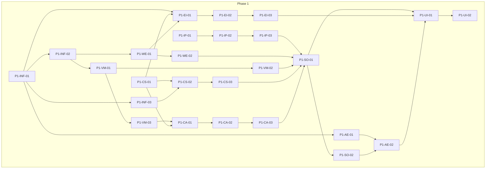

# 《星穹铁道剧情复现计划》WBS 任务分解表

本文档基于《概要设计》中的系统总体架构、实施阶段与关键流程，对需求进行 WBS 分解。任务 ID 规范：`P{Phase}-{模块缩写}-{序号}`。

**模块缩写**：INF=基础设施与数据模型，VM=信息与视野管理，CS=人物状态与演化，IP=用户输入解析，WE=世界引擎，CA=角色 Agent，SO=剧情推进编排，EI=导出/导入，AE=锚点与对比评估，UI=表现层。

---

## 一、Phase 1 任务分解

| 任务 ID | 任务名称 | 所属 Phase | 所属模块 | 前置任务 | 产出物/验收标准 | 优先级 | 备注 |
|---------|----------|------------|----------|----------|------------------|--------|------|
| P1-INF-01 | 定义核心数据模型（Character/WorldState/Information） | Phase 1 | 基础设施与数据模型 | — | 数据模型文档或 Schema；Character/WorldState/Information 等实体定义 | P0 | 与概要设计 §4.1 一致 |
| P1-INF-02 | 定义存储形态与读写接口（状态、信息库） | Phase 1 | 基础设施与数据模型 | P1-INF-01 | 状态存储与信息库的读写接口或实现 | P0 | 可为内存+文件，技术选型后落实 |
| P1-INF-03 | 配置加载（JSON/YAML）与配置样例 | Phase 1 | 基础设施与数据模型 | P1-INF-01 | 配置加载逻辑；至少 1 份人设/场景/触发表配置样例 | P0 | |
| P1-VM-01 | 全局信息库与每人已知信息库的存储与读写 | Phase 1 | 信息与视野管理 | P1-INF-02 | 全局信息库、按人物 ID 的已知信息库读写 API | P0 | |
| P1-VM-02 | 事件驱动下的信息归属规则（目睹/听闻/被告知） | Phase 1 | 信息与视野管理 | P1-VM-01 | 事件→信息归属规则配置或实现；目睹/听闻/被告知至少一种 | P0 | 推理可 Phase 2 |
| P1-VM-03 | Agent 调用前的「过滤后视野」接口 | Phase 1 | 信息与视野管理 | P1-VM-01 | 输入人物 ID，输出该人物已知信息子集（供 Agent 注入） | P0 | 视野隔离验收依赖此接口 |
| P1-CS-01 | 人物状态维度结构（关系/能力/修养/性格/视野）与量化表示 | Phase 1 | 人物状态与演化 | P1-INF-01 | 状态维度定义与存储结构；至少关系维度可量化（如 0–100） | P0 | |
| P1-CS-02 | 触发表配置格式与加载 | Phase 1 | 人物状态与演化 | P1-CS-01, P1-INF-03 | 触发表 JSON/YAML 格式；加载后能按事件类型查找变化规则 | P0 | |
| P1-CS-03 | 至少 1 个关系维度的触发表执行与状态更新 | Phase 1 | 人物状态与演化 | P1-CS-02 | 给定事件，更新受影响人物关系；状态更新与读取接口 | P0 | 验收：触发表生效 |
| P1-IP-01 | 用户输入分类（指令/对话/无意义） | Phase 1 | 用户输入解析 | — | 输入文本→类型标签；规则或轻量模型 | P0 | |
| P1-IP-02 | 指令型与对话型解析与输出结构 | Phase 1 | 用户输入解析 | P1-IP-01 | 指令型→目标角色 ID+动作类型；对话型→目标角色 ID+文本内容 | P0 | |
| P1-IP-03 | 权限校验与越权拒绝行为 | Phase 1 | 用户输入解析 | P1-IP-02 | 可配置「用户可修改范围」与「不可变锚点」；越权请求返回明确拒绝 | P0 | |
| P1-WE-01 | 单场景、简单环境状态（物理/社会/氛围）的维护与查询 | Phase 1 | 世界引擎 | P1-INF-02 | 当前场景 ID、环境状态读写；世界状态查询 API | P0 | |
| P1-WE-02 | 事件链的追加与当前节点维护 | Phase 1 | 世界引擎 | P1-WE-01 | 事件链追加接口；当前情节节点 ID 的读写 | P0 | |
| P1-CA-01 | Agent 输入输出约定（人物状态+过滤后视野，不接收全局状态） | Phase 1 | 角色 Agent | P1-VM-03, P1-CS-01 | 接口文档或类型定义：输入仅含该人物状态与视野、当前场景描述 | P0 | |
| P1-CA-02 | 基于「人物状态+过滤后视野」的对话/行动生成（单角色） | Phase 1 | 角色 Agent | P1-CA-01 | 单角色调用下生成对话或行动；不泄露未在视野中的信息 | P0 | |
| P1-CA-03 | 双角色场景下的分别调用与结果汇总 | Phase 1 | 角色 Agent | P1-CA-02 | 在场 2 人分别注入各自视野后调用；返回 2 份输出供编排使用 | P0 | |
| P1-SO-01 | 串联流程：用户输入→解析→世界/信息/状态更新→Agent 调用→结果写回 | Phase 1 | 剧情推进编排 | P1-IP-03, P1-WE-02, P1-VM-02, P1-CS-03, P1-CA-03 | 单轮推进流程打通；与概要设计 5.1 一致 | P0 | |
| P1-SO-02 | 单节点原剧情对比所需数据就绪（当前分支状态可被锚点模块读取） | Phase 1 | 剧情推进编排 | P1-SO-01 | 编排器在每轮结束后写入当前状态；锚点模块可读取当前分支状态 | P0 | |
| P1-EI-01 | 人物/场景的 JSON 序列化与反序列化 | Phase 1 | 导出/导入 | P1-INF-01, P1-CS-01, P1-WE-01 | 导出包格式说明（含元数据、依赖 ID 列表）；序列化/反序列化实现 | P0 | |
| P1-EI-02 | 导入时冲突检查（ID 冲突、依赖缺失）策略实现（先固定一种） | Phase 1 | 导出/导入 | P1-EI-01 | 冲突时提示或拒绝；至少一种策略文档化 | P0 | |
| P1-EI-03 | 导出/导入成功与失败用例验证 | Phase 1 | 导出/导入 | P1-EI-02 | 人物/场景 JSON 可导出并成功导入到新会话；冲突场景有明确结果 | P0 | 验收：导出包可导入 |
| P1-AE-01 | 锚点数据模型与必填字段落地 | Phase 1 | 锚点与对比评估 | P1-INF-01 | 锚点存储格式（节点 ID、剧情线 ID、人物反应与已知信息、环境与情节等） | P0 | 与概要设计 3.4 一致 |
| P1-AE-02 | 当前分支与锚点的「人物状态+视野」对比与差异说明 | Phase 1 | 锚点与对比评估 | P1-AE-01, P1-SO-02 | 对比结果结构（总评/分维度/差异列表）；可为 Phase 2 报告 UI 留接口 | P0 | |
| P1-UI-01 | 用户输入框、剧情/对话展示、导出/导入入口、对比触发与结果展示 | Phase 1 | 表现层 | P1-SO-01, P1-EI-03, P1-AE-02 | 可完成 Phase 1 验收的端到端操作路径（CLI 或简单 Web） | P0 | |
| P1-UI-02 | 视野隔离验收：1 场景+2 角色下某信息仅 A 知时 B 不泄露 | Phase 1 | 表现层 | P1-UI-01 | 验收用例通过；B 的回复不包含仅 A 所知信息 | P0 | Phase 1 验收标准① |

---

## 二、Phase 2 任务分解

| 任务 ID | 任务名称 | 所属 Phase | 所属模块 | 前置任务 | 产出物/验收标准 | 优先级 | 备注 |
|---------|----------|------------|----------|----------|------------------|--------|------|
| P2-CS-01 | 多角色状态与势力/关系扩展 | Phase 2 | 人物状态与演化 | P1-CS-03 | 势力、多角色关系网维护；触发表扩展 | P0 | |
| P2-WE-01 | 道具与剧情节点/分支、多场景支持 | Phase 2 | 世界引擎 | P1-WE-02 | 道具状态、分支定义、多场景切换 | P0 | |
| P2-VM-01 | 信息推理规则（可选）与遗忘/模糊规则配置 | Phase 2 | 信息与视野管理 | P1-VM-02 | 推理规则配置；遗忘/模糊触发条件与执行 | P1 | |
| P2-CA-01 | 多 Agent 冲突裁决（优先级或先提交先执行） | Phase 2 | 角色 Agent | P1-CA-03 | 多人在场时冲突裁决逻辑；无死锁 | P0 | Phase 2 验收① |
| P2-SO-01 | 状态/环境快照保存与加载 | Phase 2 | 剧情推进编排 | P1-SO-01, P2-CS-01, P2-WE-01 | 快照保存与读档；当前分支状态可恢复 | P0 | |
| P2-EI-01 | 导入冲突与适配策略（ID 冲突/状态覆盖/依赖缺失）可配置或多种策略 | Phase 2 | 导出/导入 | P1-EI-02 | 至少一种冲突策略可用且文档化；人物状态快照导入到另一剧情 | P0 | Phase 2 验收②③ |
| P2-AE-01 | 人物视野与判断对比报告（含差异说明） | Phase 2 | 锚点与对比评估 | P1-AE-02 | 报告含「人物视野与判断」维度及差异说明 | P0 | Phase 2 验收④ |
| P2-UI-01 | 多角色/多场景下的表现层与快照/读档 UI | Phase 2 | 表现层 | P2-SO-01, P2-EI-01 | 支持多角色剧情展示、快照列表与读档、对比报告展示 | P1 | |

---

## 三、Phase 3 任务分解

| 任务 ID | 任务名称 | 所属 Phase | 所属模块 | 前置任务 | 产出物/验收标准 | 优先级 | 备注 |
|---------|----------|------------|----------|----------|------------------|--------|------|
| P3-AE-01 | 主题定义与主题一致性评估 | Phase 3 | 锚点与对比评估 | P2-AE-01 | 主题配置与评估维度；主题一致性得分 | P1 | |
| P3-AE-02 | 贴合度权重与评分规则可配置并生效 | Phase 3 | 锚点与对比评估 | P2-AE-01 | 权重与评分规则可配置；至少 1 条完整剧情线含锚点、对比报告可生成 | P0 | Phase 3 验收①② |
| P3-EI-01 | 势力/情节线/主题导出与复用 | Phase 3 | 导出/导入 | P2-EI-01 | 导出包含主题/情节线可导入并参与新剧情 | P0 | Phase 3 验收③ |
| P3-CS-01 | 演化约束与合理性规则可配置 | Phase 3 | 人物状态与演化 | P2-CS-01 | 能力/性格变化上下限与合理性校验 | P1 | |
| P3-INF-01 | 性能与存储上限（响应时间、快照数量等） | Phase 3 | 基础设施与数据模型 | P2-SO-01 | 响应时间与存储上限符合设计指标；可配置快照上限 | P1 | Phase 3 验收④ |
| P3-SO-01 | 剧情死胡同等异常兜底逻辑 | Phase 3 | 剧情推进编排 | P2-SO-01 | 无推进路径时提示或触发支线；状态/快照损坏时回滚与提示 | P1 | |
| P3-UI-01 | 状态可视化与对比分维度视图（可选） | Phase 3 | 表现层 | P2-UI-01 | 人物关系/能力/视野状态展示；分维度对比视图 | P2 | |

---

## 四、任务依赖关系简图

---

## 五、与概要设计的对应关系

| 概要设计章节 | WBS 覆盖 |
|--------------|----------|
| §2.2 核心模块划分 | Phase 1 按 8 大模块 + 基础设施 + 表现层分解；Phase 2/3 在同上模块上扩展 |
| §5.1 用户输入推进剧情 | P1-IP-*、P1-SO-01 串联流程 |
| §5.2 对比与评估 | P1-AE-*、P2-AE-01、P3-AE-* |
| §5.3 导出与导入 | P1-EI-*、P2-EI-01、P3-EI-01 |
| §6 实施阶段与验收 | Phase 1/2/3 验收标准已写入各阶段任务的「产出物/验收标准」 |

技术选型确定后，可在本表「备注」列或单独「实现方式/技术引用」列中补充引用（如「状态存储：见技术选型 §3」）。
