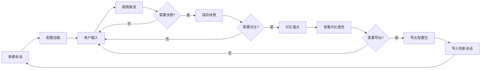

# UI-01 体验目标与信息架构（MVP）

**文档版本**：v1.0
**创建时间**：2026-02-04
**负责人**：PM/UX/TL
**状态**：Draft

---

## 一、Phase 1 MVP 范围与目标

### 1.1 MVP 核心目标

Phase 1 MVP 旨在验证核心技术可行性，完成端到端的剧情复现流程，重点验证：

1. **视野隔离**：人物 Agent 仅基于其已知信息生成对话，不泄露全局信息
2. **导出/导入**：人物、场景等配置包可导出并导入到新会话
3. **单节点对比**：当前分支与原剧情锚点的状态对比可生成差异报告

### 1.2 Phase 1 验收标准（对齐概要设计）

| 验收项 | 说明 | 对应任务 |
|--------|------|----------|
| ① 视野隔离验收 | 1 场景 + 2 角色下，某信息仅 A 知时，B 不泄露 | P1-UI-02 |
| ② 导出/导入可用 | 人物/场景 JSON 可导出并成功导入到新会话 | P1-EI-03 |
| ③ 输入解析容错 | 越权请求有明确拒绝；模糊输入有提示 | P1-IP-03 |
| ④ 单轮推进流程 | 用户输入→解析→状态更新→Agent 调用→结果展示 | P1-SO-01 |
| ⑤ 单节点对比 | 当前分支与锚点的人物状态+视野对比输出差异说明 | P1-AE-02 |

---

## 二、用户路径与核心流程

### 2.1 MVP 用户路径（端到端）



### 2.2 核心流程详解

#### 流程 1：新建会话与配置加载

**用户目标**：开始一个新的剧情复现会话

**操作步骤**：
1. 用户选择"新建会话"
2. 系统提示选择或上传配置包（人物、场景、触发表）
3. 系统加载配置，初始化世界状态
4. 进入剧情推进界面

**关键信息**：
- 会话 ID
- 加载的配置包列表（人物、场景）
- 初始场景描述

---

#### 流程 2：用户输入与剧情推进

**用户目标**：通过输入推进剧情，观察人物反应

**操作步骤**：
1. 用户在输入框输入文本（指令/对话/场景修改）
2. 系统解析输入类型并校验权限
3. 系统更新世界状态、信息库、人物状态
4. 系统调用相关人物 Agent 生成对话/行动
5. 系统展示剧情推进结果（对话、状态变化）

**关键信息**：
- 当前场景描述
- 在场人物列表
- 剧情对话历史
- 人物状态摘要（可折叠）

**容错与反馈**：
- 模糊输入：提示"未识别的指令，请重新输入"
- 越权请求：提示"该操作超出权限范围，无法修改锚点人物的核心设定"
- 无推进路径：提示"当前输入无法推进剧情，请尝试其他方向"

---

#### 流程 3：快照保存

**用户目标**：保存当前剧情状态，便于后续回溯或对比

**操作步骤**：
1. 用户点击"保存快照"按钮
2. 系统提示输入快照名称（可选）
3. 系统保存当前世界状态、人物状态、信息库
4. 系统提示"快照已保存"

**关键信息**：
- 快照 ID
- 快照名称
- 保存时间
- 当前剧情节点 ID

---

#### 流程 4：对比锚点

**用户目标**：对比当前分支与原剧情锚点的差异

**操作步骤**：
1. 用户点击"对比锚点"按钮
2. 系统提示选择锚点（剧情线 ID + 节点 ID）
3. 系统执行对比：人物状态、视野、环境、情节
4. 系统生成对比报告并展示

**关键信息**：
- 锚点节点 ID
- 对比维度（人物状态、视野、环境、情节）
- 差异列表（详细说明）
- 贴合度评分（Phase 2-3 扩展）

---

#### 流程 5：导出/导入配置包

**用户目标**：导出人物/场景配置，复用到其他会话

**操作步骤（导出）**：
1. 用户点击"导出"按钮
2. 系统提示选择导出类型（人物/场景/完整会话）
3. 系统序列化为 JSON 并下载

**操作步骤（导入）**：
1. 用户点击"导入"按钮
2. 系统提示上传 JSON 文件
3. 系统检查冲突（ID 冲突、依赖缺失）
4. 系统提示冲突处理策略（拒绝/覆盖/重命名）
5. 系统导入成功并提示

**关键信息**：
- 导出包元数据（版本、类型、依赖 ID）
- 冲突检查结果
- 导入成功/失败提示

---

## 三、信息架构与页面清单

### 3.1 信息架构层级

```
应用根目录
├── 会话管理
│   ├── 会话列表
│   ├── 新建会话
│   └── 会话详情
├── 剧情推进（主界面）
│   ├── 场景描述区
│   ├── 对话历史区
│   ├── 用户输入区
│   ├── 人物状态面板（可折叠）
│   └── 操作工具栏（快照/对比/导出）
├── 快照管理
│   ├── 快照列表
│   └── 快照详情
├── 对比报告
│   ├── 锚点选择
│   ├── 对比结果展示
│   └── 差异详情
└── 导出/导入
    ├── 导出配置
    ├── 导入配置
    └── 冲突处理
```

### 3.2 页面清单（MVP 最小集）

| 页面 ID | 页面名称 | 优先级 | 说明 |
|---------|----------|--------|------|
| P01 | 会话列表 | P0 | 展示所有会话，支持新建/删除/进入 |
| P02 | 新建会话 | P0 | 选择或上传配置包，初始化会话 |
| P03 | 剧情推进（主界面） | P0 | 核心交互界面，包含场景、对话、输入、状态面板 |
| P04 | 人物状态面板 | P0 | 展示当前在场人物的状态摘要（可折叠） |
| P05 | 快照列表 | P0 | 展示当前会话的所有快照，支持保存/加载 |
| P06 | 对比报告 | P0 | 展示当前分支与锚点的对比结果 |
| P07 | 导出/导入对话框 | P0 | 导出/导入配置包，处理冲突 |

---

## 四、关键交互与容错设计

### 4.1 输入解析与容错

| 输入类型 | 示例 | 系统行为 | 容错提示 |
|----------|------|----------|----------|
| 指令型 | "让三月七进入房间" | 解析为指令，更新场景状态 | 越权时提示"无法修改锚点人物的核心设定" |
| 对话型 | "你好，三月七" | 解析为对话，调用三月七 Agent | 目标人物不在场时提示"三月七不在当前场景" |
| 场景修改 | "天气变为下雨" | 更新环境状态 | 越权时提示"该操作超出权限范围" |
| 无意义输入 | "asdfgh" | 识别为无意义 | 提示"未识别的指令，请重新输入" |

### 4.2 视野隔离验收交互

**验收场景**：1 场景 + 2 角色（A、B），某信息仅 A 知时，B 不泄露

**交互设计**：
1. 用户输入："告诉 A 一个秘密：星核的位置在 X"
2. 系统更新 A 的已知信息库，B 不知道
3. 用户输入："问 B 星核在哪里"
4. 系统调用 B 的 Agent，注入 B 的视野（不含星核位置）
5. B 回复："我不知道星核在哪里"（验收通过）

**验收失败示例**：
- B 回复："星核在 X"（泄露了仅 A 所知的信息，验收失败）

### 4.3 导入冲突处理交互

**冲突场景**：导入的人物 ID 与当前会话中的人物 ID 冲突

**交互设计**：
1. 用户上传导入包
2. 系统检测到 ID 冲突："人物 ID 'march7th' 已存在"
3. 系统提示选择策略：
   - **拒绝导入**：取消导入，保持当前会话不变
   - **覆盖**：用导入包中的人物覆盖当前会话中的人物
   - **重命名**：为导入的人物生成新 ID（如 'march7th_imported'）
4. 用户选择策略，系统执行并提示结果

---

## 五、响应式设计要求（Material 3）

### 5.1 断点与布局

| 断点 | 屏幕宽度 | 布局方式 | 说明 |
|------|----------|----------|------|
| xs | < 600px | 单列，垂直堆叠 | 手机端，隐藏次要信息 |
| sm | 600px - 960px | 单列，部分折叠 | 平板竖屏，状态面板可折叠 |
| md | 960px - 1280px | 双列，主次分离 | 平板横屏，左侧对话，右侧状态 |
| lg | 1280px - 1920px | 三列，完整展示 | 桌面端，左侧场景，中间对话，右侧状态 |
| xl | > 1920px | 三列，宽松间距 | 大屏桌面，增加边距与字号 |

### 5.2 移动优先设计原则

1. **核心功能优先**：手机端优先展示输入框、对话历史、场景描述
2. **渐进增强**：平板/桌面端逐步展示人物状态、快照列表、对比报告
3. **触控友好**：按钮最小点击区域 48x48dp，间距至少 8dp
4. **手势支持**：支持滑动切换快照、下拉刷新对话历史

### 5.3 Material 3 设计元素

| 元素 | 说明 | 示例 |
|------|------|------|
| 色彩系统 | 动态主题色（Material You），支持深色模式 | 主色：蓝色系，强调色：橙色系 |
| 排版 | Roboto 字体，标题/正文/标注层级清晰 | 标题：24sp，正文：16sp，标注：12sp |
| 组件 | 使用 Vuetify 3 组件（按钮、卡片、对话框、列表） | v-btn, v-card, v-dialog, v-list |
| 动效 | 页面切换使用 Material 标准动效（淡入淡出、滑动） | 300ms 缓动曲线 |
| 图标 | Material Design Icons | mdi-account, mdi-map-marker, mdi-compare |

---

## 六、跨平台预留设计

### 6.1 为 Flutter 客户端预留的设计考虑

1. **组件化设计**：Web 端组件结构与 Flutter Widget 对应
   - 示例：`CharacterCard` 组件 → Flutter `CharacterCardWidget`
2. **API 统一**：Web 端与 Flutter 端共用同一套 REST API
   - 示例：`POST /api/sessions/{id}/advance` 推进剧情
3. **Material 3 一致性**：Web 端使用 Vuetify 3，Flutter 端使用 Material 3 组件
   - 保证视觉风格与交互模式一致
4. **响应式数据结构**：API 返回的 JSON 结构适配多端
   - 示例：人物状态包含 `displayName`、`avatar`、`statusSummary` 等字段

### 6.2 组件映射表（Web ↔ Flutter）

| Web 组件（Vuetify 3） | Flutter Widget | 说明 |
|----------------------|----------------|------|
| v-btn | ElevatedButton / TextButton | 按钮 |
| v-card | Card | 卡片 |
| v-dialog | Dialog / AlertDialog | 对话框 |
| v-list | ListView | 列表 |
| v-text-field | TextField | 输入框 |
| v-app-bar | AppBar | 顶部导航栏 |
| v-navigation-drawer | Drawer | 侧边栏 |

---

## 七、后续行动

### 7.1 下一步工作

1. **UI-02 关键页面线框稿**（W1）
   - 产出：P01-P07 页面的线框稿（低保真）
   - 工具：Figma / Sketch / 手绘
2. **UI-03 交互稿**（W2）
   - 产出：交互说明文档，覆盖容错与越权反馈
3. **UI-04 视觉稿与组件规范**（W2）
   - 产出：高保真视觉稿 + Material 3 组件规范

### 7.2 待确认事项

| 事项 | 说明 | 负责人 | 截止时间 |
|------|------|--------|----------|
| CLI vs Web 优先级 | Phase 1 是否先做 CLI 原型？ | PM/TL | W1 |
| 快照数量上限 | Phase 1 是否限制快照数量？ | TL | W1 |
| 对比报告详细程度 | Phase 1 对比报告是否需要分维度展示？ | PM/UX | W1 |

---

## 八、附录

### 8.1 参考文档

- [概要设计.md](概要设计.md) - 核心功能与交互流程
- [WBS任务分解表.md](WBS任务分解表.md) - Phase 1 任务清单
- [技术选型与架构设计.md](技术选型与架构设计.md) - Material 3 设计规范

### 8.2 术语表

| 术语 | 说明 |
|------|------|
| 视野 | 人物当前已知的信息集合 |
| 锚点 | 原剧情中的关键节点，用于对比 |
| 快照 | 当前剧情状态的完整保存 |
| 配置包 | 人物/场景/触发表等配置的序列化文件 |
| 触发表 | 事件→状态变化的规则配置 |

---

**文档状态**：待评审
**下一步**：UI-02 关键页面线框稿（W1）
